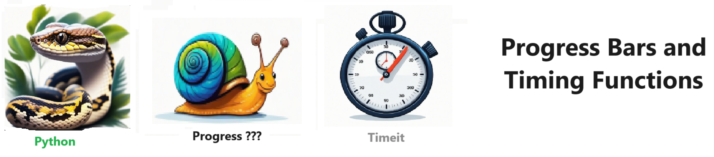

# Progress Bars   - Quickly generate progress bars - Its EASY !!!   

Welcome to Progress Bars   - Quickly generate progress bars - Its EASY !!!   
  

The are many ways to do this. It isnt perfect !!! so Experiment. Branch it and Change it. Collaborate and HAVE FUN !!! 

## Getting Started

To get started with the ** Progress Bars ** project, follow these steps:

1. Clone the repository to your local machine.
2. Install the required dependencies listed at the top of the notebook.
3. Explore the example code provided in the repository and experiment.
4. Run the notebook and your find your most Critical Data - EASY !

